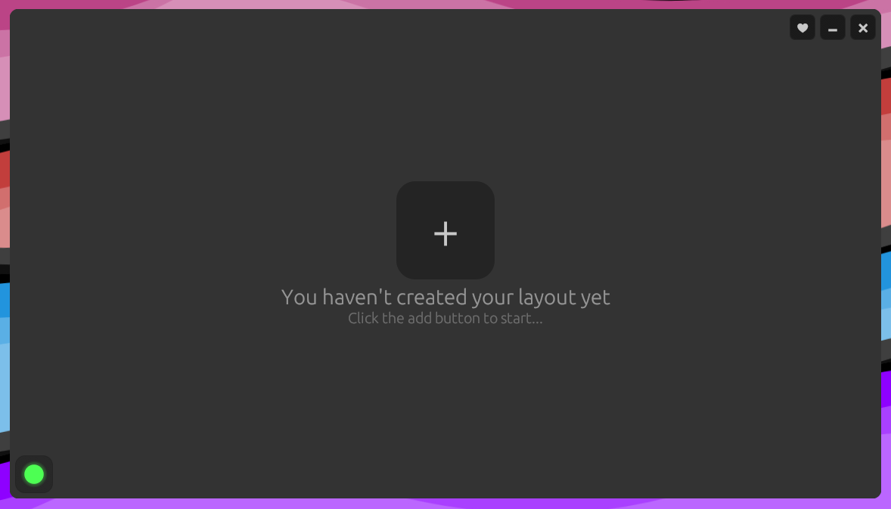
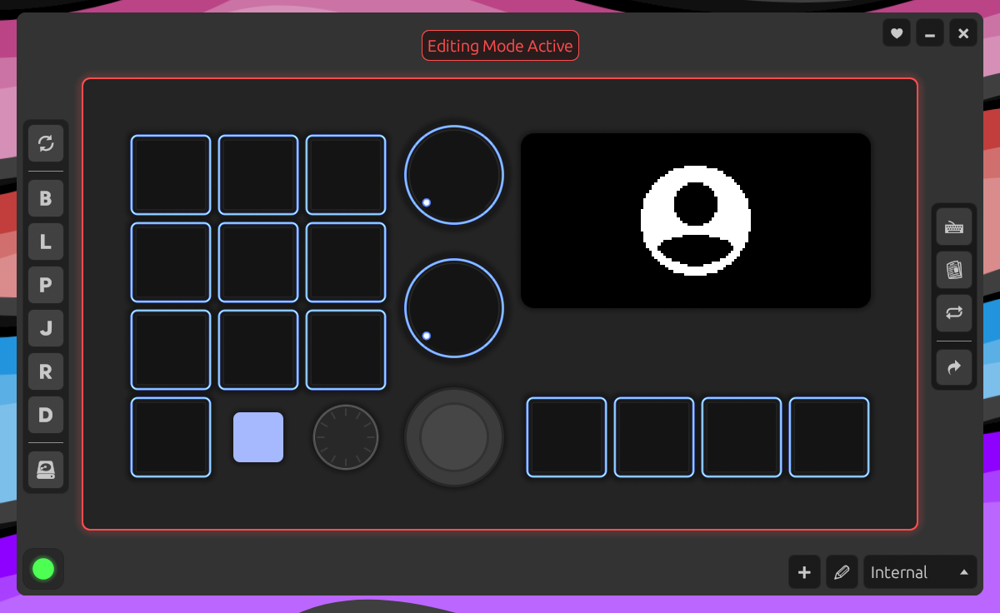
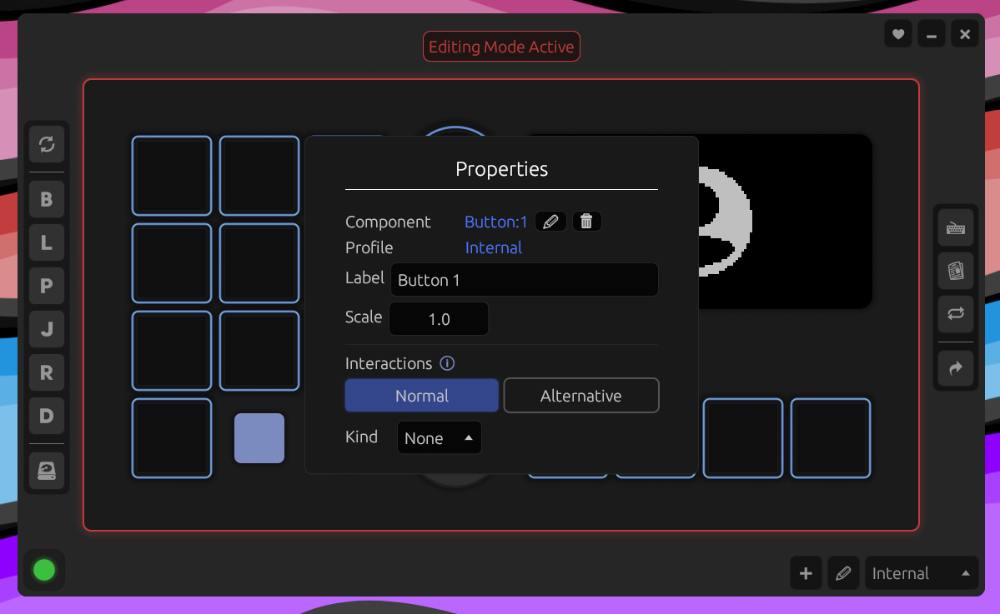
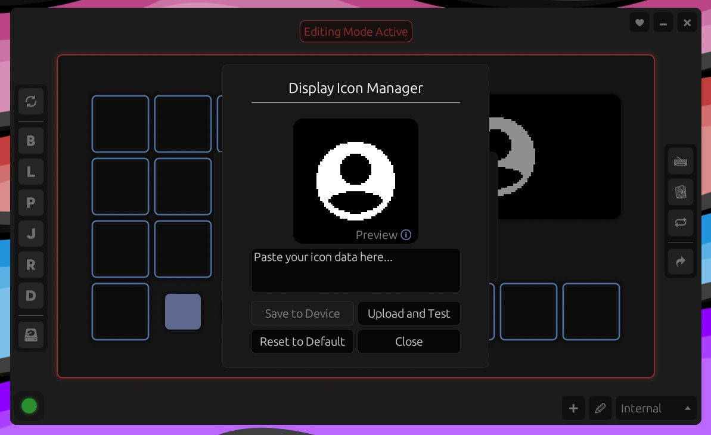
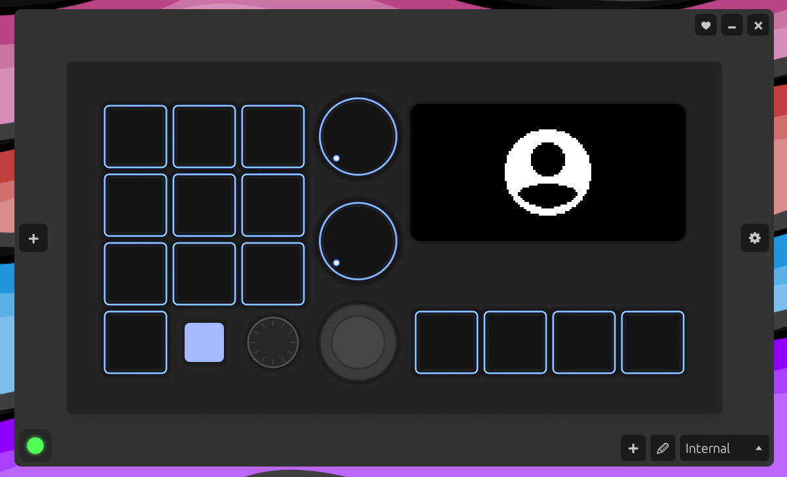
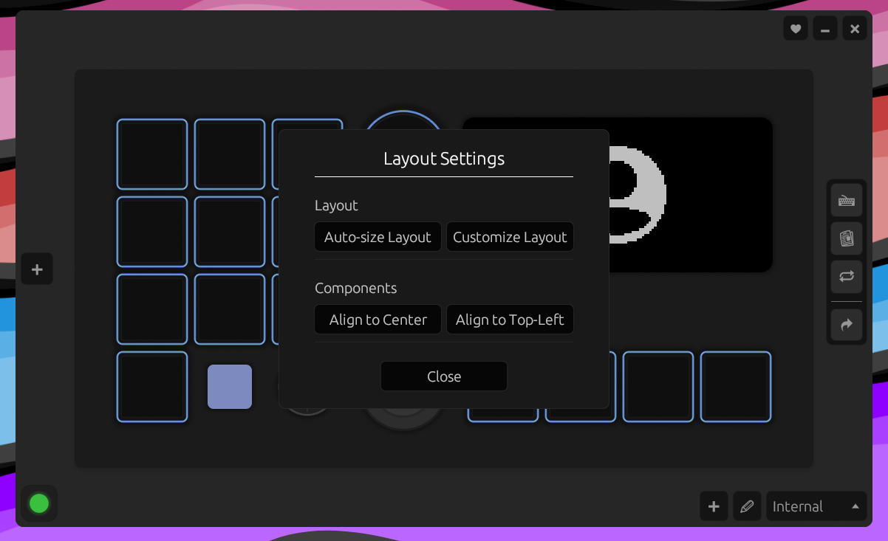
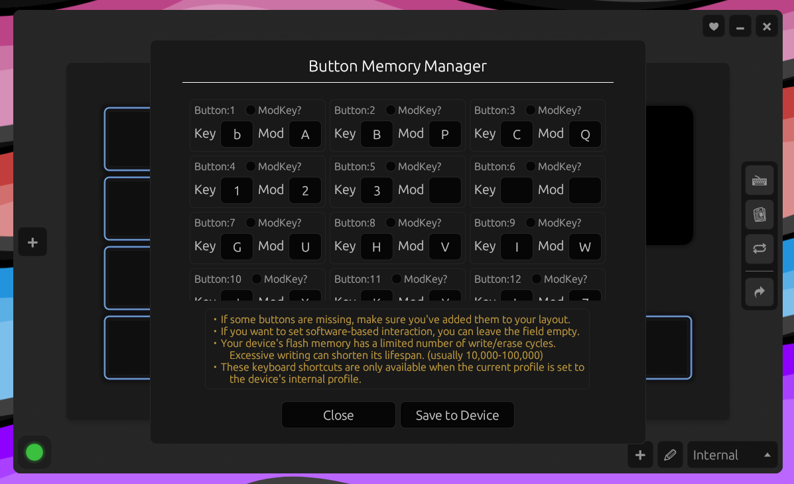
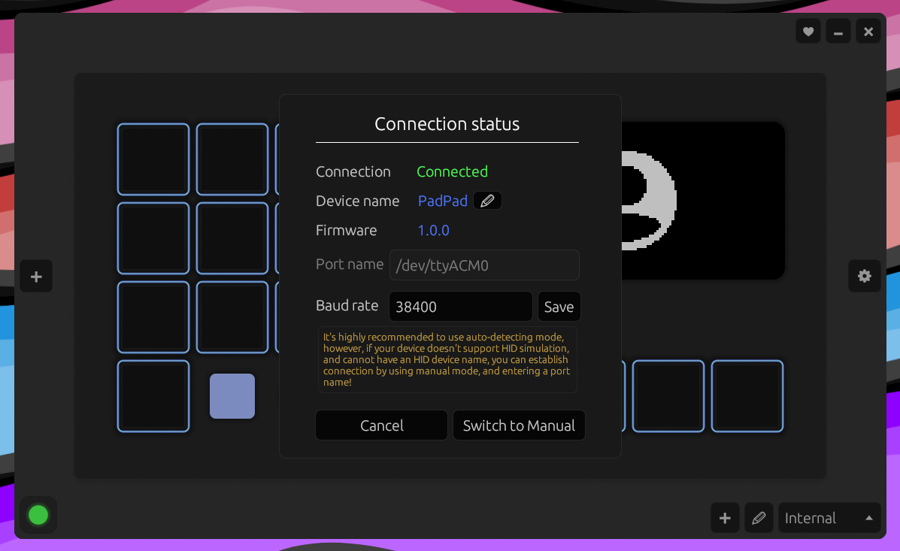
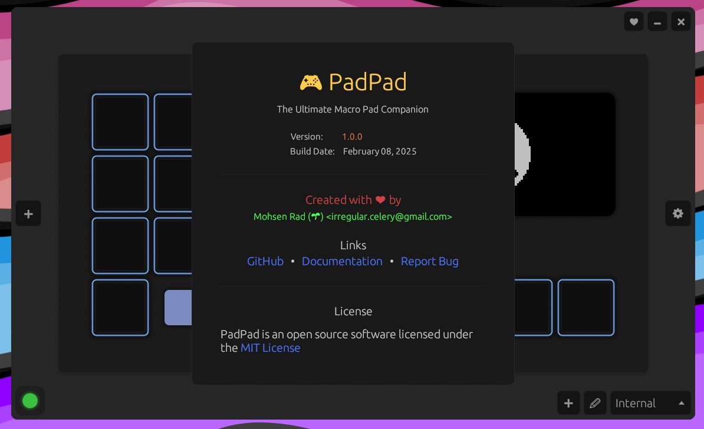

# PadPad Software

#### PadPad is a customizable macro pad that allows users to execute pre-configured actions through physical components (buttons, knobs, etc.).<br>This repository contains the software that interacts with the PadPad device.

### [🚀 Firmware Repository](https://github.com/IrregularCelery/padpad.firmware) | [📺 YouTube Video (Coming Soon!)]()

## Table of Contents

- [Overview](#-overview)
- [Features](#-key-features)
  - [Dashboard](#dashboard-gui-app)
  - [Service](#service-background-process)
- [Installation](#%EF%B8%8F-installation)
- [Build from Source](#%EF%B8%8F-build-from-source)
- [Quick Start](#-quick-start)
- [Using the Dashboard](#%EF%B8%8F-using-the-dashboard)
- [Confile File](#-config-file)
- [Screenshots](#%EF%B8%8F-screenshots)
- [Known Issues](#%EF%B8%8F-known-issues)
- [Contributing](#-contributing)
- [Links](#-links)
- [License](#-license)

## 📖 Overview

**The PadPad software suite consists of two applications:**

1. **Dashboard**: A GUI app to configure device components (buttons, potentiometers, etc.), set interactions, and manage profiles.
2. **Service**: A background app that communicates with the PadPad device to execute interactions.

## ✨ Key Features

### Dashboard (GUI App)

- Configure buttons, potentiometers, interactions, etc.
- Set up multiple profiles for different use cases.
- Assign interactions such as opening applications, running commands, simulating keyboard shortcuts, and more.
- "Button Memory" mode for device-side interactions, even if device isn't paired with the `Service` app.
- Detect and add buttons and potentiometers from the device automatically.

### Service (Background Process)

- Establishes and maintains communication between the device and the software.
- Supports automatic and manual connection modes.
- Can use HID to detect the device by name and determine the correct serial port.
- Ensures seamless operation on Unix-like systems where serial ports might be temporarily inaccessible.

## ⚙️ Installation

### Prebuilt Binaries

Download the latest release for your OS from the [Releases page](https://github.com/IrregularCelery/padpad.software/releases).

> MacOS is untested, but contributions/testing are welcome!

### Linux Dependencies

Ensure the following packages are installed if you're using `X11`:

- Arch Linux (pacman)

  ```bash
  sudo pacman -S xdotool xdg-utils # X11
  ```

- Ubuntu/Debian (apt)

  ```bash
  sudo apt install libxdo-dev xdg-utils # X11
  ```

###### Other distributions will need equivalent packages installed.

> These are required for opening apps/websites and simulating keystrokes. The `xdg-open` utility is used by the [open crate](https://crates.io/crates/open), and `xdotool` is required by the [enigo crate](https://crates.io/crates/enigo).

## 🛠️ Build from Source

1. Clone the repository:

   ```bash
   git clone https://github.com/IrregularCelery/padpad.software.git
   ```

2. Build with Cargo:

   ```bash
   # Service app
   cargo build --release

   # Dashboard app
   cargo build --release --bin dashboard
   ```

   Binaries will be in `target/release/`.

### Customizing Before Compilation

Modify `constants.rs` to set values like:

- `DEFAULT_DEVICE_NAME`
- `APP_MIN_WIDTH/HEIGHT`
- `CONFIG_FILE_NAME`
- &nbsp;...

> Some of these can also be changed dynamically via the Dashboard.

## 🚀 Quick Start

1. **Connect your [PadPad device](https://github.com/IrregularCelery/padpad.firmware)** via usb.
2. **Run the Service app** (keep it running in the background).
3. **Launch the Dashboard app** to configure your device.

## 🎛️ Using the Dashboard

### Creating layout

- Click the large "**`+`**" button to create a layout.
- If you're unsure about the layout size, enter any value. You can use the "`Auto-size Layout`" feature later to adjust it.

### Configuring Components

- Once you've created a layout, two buttons will appear on either side. The button on the right "`+`" opens the "Components" panel, and the button on the left "**`⚙`**" opens the "Toolbar" panel.
- To enter "`Editing Mode`", click the "Components" panel button.
- There are two ways to add components to your layout:
  - Click the **`🗘`** Button to automatically detect the components from your device.<br>**(currently only supports buttons and potentiometers)**
    <br>--- or ---
  - Click any component to manually add it to your layout:
    - **`B`** : **Button**
    - **`L`** : **LED**
    - **`P`** : **Potentiometer**
    - **`J`** : **Joystick**
    - **`R`** : **RotaryEncoder**
    - **`D`** : **Display** (graphical lcd)
      <br>&nbsp;
- In "Editing Mode", click a component in your layout to edit its properties and set up interactions.

  - **Interaction Types**
    - **None**: No software action (useful when configuring "Button Memory").
    - **Command**: Run a shell command.
    - **Application**: Launch an application.
    - **Website**: Open a URL.
    - **Shortcut**: Simulate keypresses (Ctrl+C, etc.) or type text.
    - **File**: Open a specified file.
      <br>&nbsp;
      > Component **`Button`** supports having two different interactions in the same profile.<br>
      > By holding down the **`ModKey`** and pressing a button, you can call ther **`Alternative`** action.
      >
      > **You can assign a `ModKey` from `Button Memory Manager`.**

- Make sure to save changes by clicking the **`Save`** button.
  > You can also revert the changes to the last state before entering "Editing Mode".

### Profiles

- Switch profiles from the bottom-right panel.
- Profile `Internal` is reserved for "Button Memory" ('buttons' act as standalone keyboard keys).
  > You can still set up software-based interactions for components in this profile.
- Each profile stores unique component configurations.

### Connection Settings

- Click the connection status indicator (bottom-left) to switch connection to **Manual Mode**, change **Port Name**, **Baud Rate**, etc.

## 📄 Config File

Settings are loaded from:

1. `config.toml` in the app directory (priority).
2. OS local config directory (`~/.config/padpad` on Linux, `AppData\Local\padpad` on Windows).

## 🖼️ Screenshots

<details>
<summary>Show screenshots</summary>

#### OOB



#### Editing Mode



#### Component Properties



#### Display Icon Manager



#### Complete Layout



#### Layout Settings



#### Button Memory Manager



#### Connection Status



#### About



</details>

## ⚠️ Known Issues

- **Dashboard UI Glitches**: Rapid component updates may cause visual delays (Service functionality remains unaffected).
- **Text Input Expansion**: Dashboard modals with long text might resize unexpectedly (probably egui bug).

> #### Disclaimer: Dashboard Resource Usage
>
> **PadPad Dashboard** is a GUI application that may consume slightly more resources when active. This is expected behavior and does not affect background processes.<br>
> After finishing configuration, the **Dashboard application** does not need to stay open. Only the **Service app** needs to be running in the background for **PadPad** to function.

## 🤝 Contributing

Contributions are welcome! If you find issues or have feature requests, open an issue or pull request.

## 🔗 Links

- [Firmware Setup Guide](https://github.com/IrregularCelery/padpad.firmware)
- [Report a Bug](https://github.com/IrregularCelery/padpad.software/issues)
- [YouTube Video (not a tutorial)]()

## 📜 License

**PadPad software** is 100% free and open-source under the [MIT License](/LICENSE).
